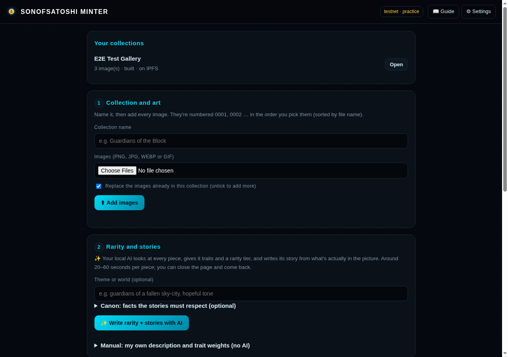
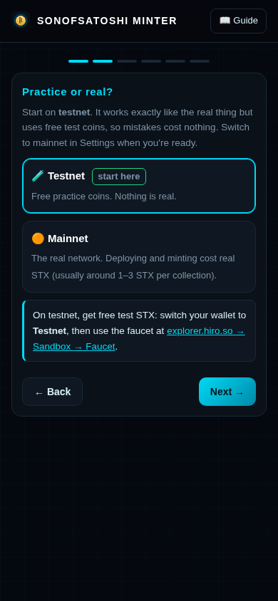
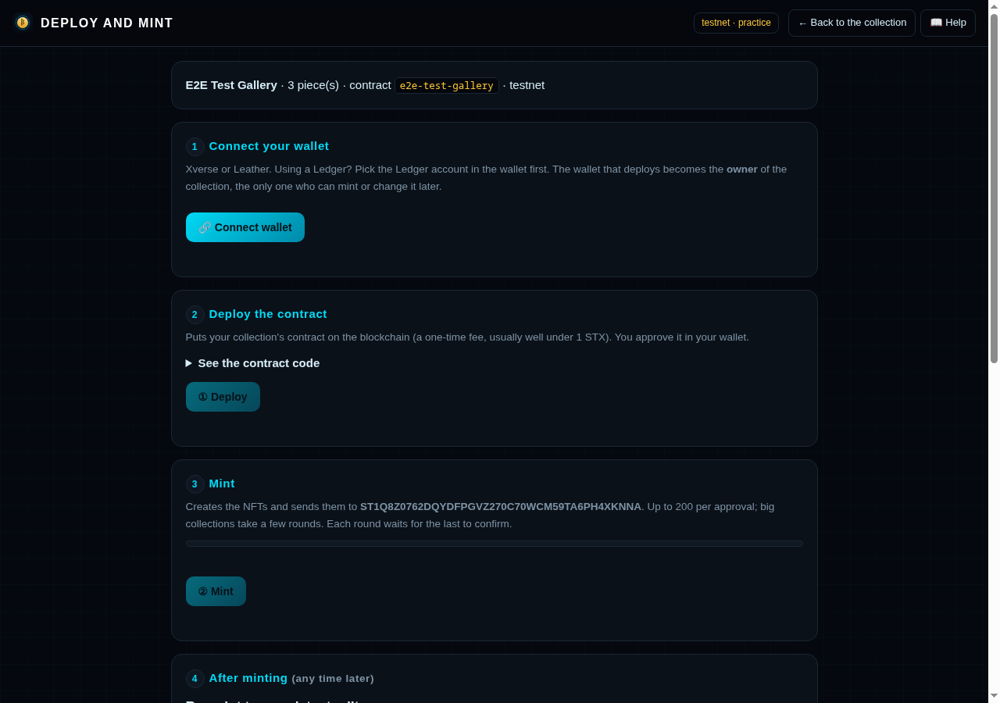

<p align="center"></p>
<h1 align="center">SonOfSatoshi Minter</h1>
<p align="center"><b>Your art. Your storage. Your wallet. Your collection on Bitcoin.</b><br>
A sovereign NFT minter for Stacks that runs entirely on your own computer.</p>

<p align="center"></p>

## What it does

Bring a folder of art. Get a finished NFT collection:

1. **Numbers** your pieces 0001, 0002 …
2. **Traits, rarity and a story for every piece.** Your own AI ([Ollama](https://ollama.com), running locally) looks at each picture, picks traits, ranks rarity across 12 tiers (Mythic → Base) and writes a story that matches what's actually in it. No GPU? Set trait weights yourself.
3. **Review and edit** every piece exactly as wallets will show it: name, story, traits, rarity and the raw metadata.
4. **Stores it on IPFS:** your own node, [Pinata](https://pinata.cloud), or both.
5. **Deploy and mint from your own wallet:** Xverse or Leather (Ledger works). Big collections mint in rounds of 200.
6. **Keep control after minting:** re-point to new edits, ask wallets to refresh (SIP-019), change the royalty, or freeze the art forever.

**It never asks for your seed phrase or private key.** Every transaction is approved by you, in your wallet.
There's no account, no server of ours, no tracking, and no fee. You pay only normal network fees.

## Why it exists

An NFT on the blockchain is only a pointer. The picture and its story live on IPFS, and **if nobody keeps those files
online, every wallet shows a blank box**. Hosts shut down, accounts lapse, computers get wiped. This minter is built so
the artist controls every piece: the files, the storage, the keys, and the contract. The contract can always be
re-pointed, so a collection is never stranded on a dead address.

## Quick start

You need **Python 3.10+**. Nothing else to install for the app itself.

```bash
git clone <this repository>
cd sonofsatoshi-minter
./run.sh            # Windows: double-click run.bat   ·   or: python3 server.py
```

Open **http://127.0.0.1:8130**. A short setup wizard walks you through:



1. **Testnet or mainnet.** Start on testnet: it's free and works exactly like the real thing.
2. **Your wallet address.** Where your NFTs and royalties go.
3. **Where your art lives.** Your own IPFS node, Pinata, or both, each with a live test button.
4. **AI (optional).** It finds Ollama and lists your models.
5. **Default royalty.**

Then follow the five steps on the main screen. The built-in **Guide** explains every part in plain words.

<br clear="right">

## What you'll need

| | Why | Required |
|---|---|---|
| Python 3.10+ | runs the app | yes |
| [Xverse](https://www.xverse.app) or [Leather](https://leather.io) | signs the deploy and mints | yes |
| a little STX | network fees ([free on testnet](https://explorer.hiro.so/sandbox/faucet?chain=testnet)) | yes |
| an IPFS node **or** a Pinata account | keeps your art online | one of them |
| [Ollama](https://ollama.com) + a GPU | AI stories and rarity | no |

### Run your own IPFS node (one command)

```bash
docker run -d --name ipfs --restart unless-stopped \
  -v ipfs_data:/data/ipfs -p 4001:4001 -p 4001:4001/udp \
  -p 127.0.0.1:5001:5001 -p 127.0.0.1:8080:8080 ipfs/kubo:latest
```

Then use `http://127.0.0.1:5001` in the setup. **Never expose port 5001 to the internet.** The in-app Guide covers
nodes on another machine, making your node reachable, public gateways and Cloudflare Tunnels.

### Or use Pinata

Create an API key (JWT) with the `pinFileToIPFS` permission at [pinata.cloud](https://pinata.cloud) and paste it in the
setup. It's stored only on your computer, readable only by you.

## Deploy and mint



Connect your wallet, then **Deploy** (the page waits for the network to confirm), then **Mint** (rounds of up to 200, each waiting for
the last). You can close the page and come back; progress is read from the chain.

## The contract

Each collection gets its own SIP-009 contract, generated in plain Clarity you can read before deploying:

| Function | Who | What |
|---|---|---|
| `mint`, `mint-many` | owner | mint to any address, up to 200 per call |
| `set-base-uri`, `set-token-uri` | owner | point the collection (or one token) at new metadata |
| `refresh-metadata` | owner | SIP-019 notice so Hiro, wallets and marketplaces re-read |
| `set-royalty` | owner | royalty in basis points (max 30%) and who receives it |
| `freeze-metadata` | owner | **one-way**: art and stories can never change again |
| `transfer`, `get-owner`, `get-token-uri`, `get-last-token-id`, `get-royalty-info`, `is-frozen` | anyone | standard reads and transfers |

The owner is the wallet that deploys it. Keep that wallet safe.

## Your files

- Collections: `~/SonOfSatoshi-Minter/projects/<Name>/`: images, metadata, contract and `state.json`. **Back this up.** With it you can restore your art to any IPFS node at the exact same addresses.
- Settings: `~/SonOfSatoshi-Minter/config.json` (owner-only permissions).
- Options: `SOS_MINTER_PORT` (default 8130), `SOS_MINTER_HOME`, `SOS_MINTER_PROJECTS`.

## Rules, help and security

- **[Rules for using it](RULES.md):** mint only what you have the rights to, no scams, test on testnet first. Please read it.
- **[Contributing](CONTRIBUTING.md)** · **[Code of Conduct](CODE_OF_CONDUCT.md)**
- **[Security](SECURITY.md):** report problems privately, never in a public issue.
- Releases are signed with minisign: `minisign -Vm <zip> -p minisign.pub`.

## License

Copyright © 2026 SonOfSatoshi. Free software under the **[GNU AGPL-3.0](LICENSE)**. You may use, study, change and
share it. If you share a changed version, or run one as a service for others, you must publish its source under the
same license. The **SonOfSatoshi** name and logo are not part of the license; see [TRADEMARK.md](TRADEMARK.md).

Provided as is, without warranty. Not financial advice.
